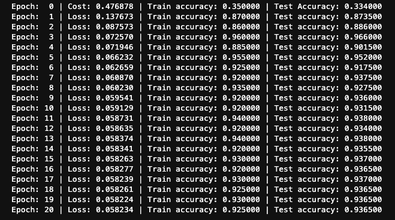

# universal-classifier
Single qubit data reuploading universal binary classifier modified from Penny Lane

These two python notebooks are modified versions of the [Data Reuploading Classifier](https://pennylane.ai/qml/app/tutorial_data_reuploading_classifier.html) from [Penny Lane](https://pennylane.ai/). One runs on the [scikit-learn](https://scikit-learn.org/stable/auto_examples/classification/plot_classifier_comparison.html#sphx-glr-auto-examples-classification-plot-classifier-comparison-py) data set 'make_moons', the other runs on the scikit-learn data set 'make_circles'. 

### Scitkit-Learn Classifier Comparison


### Default Hardware
In order to run this on an IBM quantum computer such as the 14-qubit IMB Melbourne pictured below, we simply need to change the code:
```python
dev = qml.device("default.qubit", wires=1)
```

to 

```python
dev = qml.device("ibmq_16_melbourne", wires=1)
```

#### IBM Melbourne Hardware Topology and Error Info


In the [IBMQ Experience](https://quantum-computing.ibm.com/) we can see result of experiemnet which have been run for this classifier. 

### Data Reuploading Classifier Training Data on make_moons

#### Generating the Data
Here we generate the data make_moons from scikit-learn:
```python
# Generate training and test data
num_training = 200
num_test = 2000

Xdata, y_train = make_moons(num_training, noise=0.1)
X_train = np.hstack((Xdata, np.zeros((Xdata.shape[0], 1))))

Xtest, y_test = make_moons(num_test, noise=0.1)
X_test = np.hstack((Xtest, np.zeros((Xtest.shape[0], 1))))
```

#### Epochs and Loss Function
In the notebooks, we only have 20 epochs and a single hidden layer (along with one input layer and one output layer for a total of three layers):
```python
num_layers = 3
learning_rate = 0.6
epochs = 20
batch_size = 32
```
The results are as follows: 




Comparing this to the methods given in the classifier comparison of scikit-learn we see it is not difficult to get the single qubit classifier, after only 20 epochs and with a single hidden layer, to perform better than:
- Linear Support Vector Machine
- random forest
- neural net
- AdaBoost
- Naive Bayes
- QDA

### Data Reuploading Classifier Training Data on make_circles

#### Generating the Data
Here we generate the data make_circles from scikit-learn:
```python
# Generate training and test data
num_training = 200
num_test = 2000

Xdata, y_train = make_circles(num_training, noise=0.1)
X_train = np.hstack((Xdata, np.zeros((Xdata.shape[0], 1))))

Xtest, y_test = make_circles(num_test, noise=0.1)
X_test = np.hstack((Xtest, np.zeros((Xtest.shape[0], 1))))
```

#### Epochs and Loss Function
In the notebooks, we only have 20 epochs and a single hidden layer (along with one input layer and one output layer for a total of three layers):
```python
num_layers = 3
learning_rate = 0.6
epochs = 20
batch_size = 32
```
The results are as follows: 


Comparing this to the methods given in the classifier comparison of scikit-learn we see it is not difficult to get the single qubit classifier, after only 20 epochs and with a single hidden layer, to perform better than:
- Linear Support Vector Machine
- Naive Bayes
- QDA

Disclaimer: Obviously, having an accurate comparison of the single qubit classifier above to the standard machine learning classifiers of scikit-learn requires a more detailed comparison on several comparable data sets and training parameters. This is purely a demonstration of how one can achieve nontrivial results on various data sets. 

